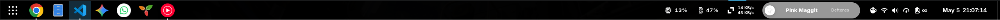

# 𜱗 Stellar GNOME

## Mission
Windows had the taskbar right, thats just the hard truth, we had all the info we needed at a glance so we could get on with being productive. I wont speak too much about the latest iteration of that taskbar...

stellar_gnome aims to give you a clean, informative GNOME experience with a few familiar tweaks for old school Windows users.

### The taskbar

stellar_gnome uses dash to panel as the extension of choice to give you all the information you need at a glance, why not dash to dock? Dash to dock a great extension, however my opinion is that having a panel at the top of the screen and a dock at the bottom is a lot of wasted space, even if the dock auto hides. Dash to panel allows us to have all the gnome panel items, along with some great extensions, running apps and more. This way we get the best of both worlds in a single bar - it's an efficient use of space and provides you the user with everything you need at a glance.

### Other tweaks
Dash to panel is probably the biggest customization, other than that we install some extensions to make life easier, you can get a full break down in the [Release notes](./releases/)

### Opinionated
stellar_gnome is opinionated, I the author have made certain tweaks and changes based on the way I use my computer, however I do feel the vast majority use computers in the same way, this is why I am sharing the project, however if you feel that you want to use this as a base to make your own scripts to customize GNOME, please do, and share it with me. Also pull requests are welcome!

### Trusted reviews
"Is this really what you have been spending your time on?" - authors girlfriend

## Time to take off? - Get Started!
| GNOME Version + Release Notes | Install Script |
|-------------------------------|----------------|
| [GNOME 50](./releases/gnome_50.md) | `wget -qO - https://raw.githubusercontent.com/howzitcal/stellar_gnome/main/gnome_50.sh \| bash` |
